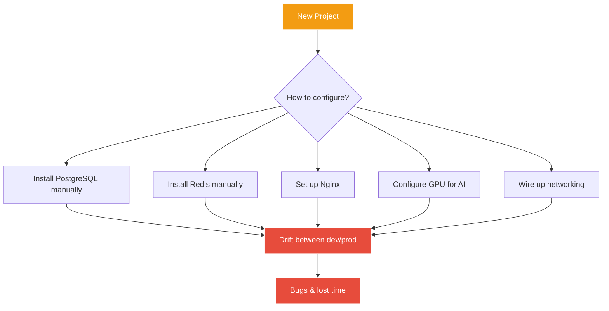
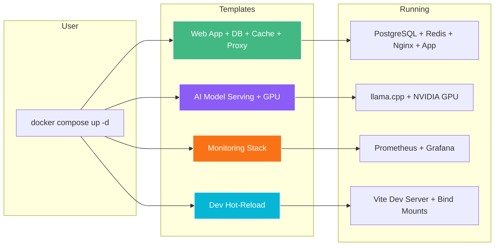
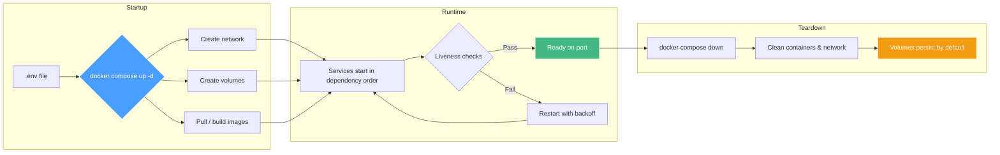

# Docker Compose Templates — Production Stacks in One Command

[](https://opensource.org/licenses/MIT)
[](https://docs.docker.com/compose/)
[]()

Zero-friction Docker Compose templates for web applications, databases, reverse proxies, monitoring, and AI model serving with GPU — `docker compose up -d` and your entire stack is running.

---

## 1. The Problem

Every time you start a new project or spin up a service, you repeat the same boilerplate. PostgreSQL needs a volume. Redis needs a network config. Nginx needs SSL. GPU passthrough for AI inferencing requires arcane `deploy.resources.reservations.devices` blocks. And the worst part — every developer on the team inevitably configures things slightly differently, introducing drift between environments.

This repository eliminates that by providing production-hardened Compose templates that work identically across Mac, Linux, and cloud VPS.



The result: hours of setup, environment-specific bugs, and a fragile stack that nobody wants to touch.

---

## 2. What This Does

Copy a template, set your `.env`, run `docker compose up -d`. That's it. Four battle-tested stacks cover 90% of what teams need:



Each template includes restart policies, health checks, named volumes, and security best practices out of the box.

---

## 3. Why Not Just Copy From a Blog Post?

| Approach | Consistency | Security | GPU Support | Maintenance |
|----------|------------|----------|-------------|-------------|
| **Blog post snippets** | Fragmented, version drift | Often hardcoded passwords | Rarely covered | You own all the debt |
| **Official Docker samples** | Minimal stacks only | Basic | None | Good, but limited scope |
| **This repo** | One source of truth across team | .env / Docker secrets | NVIDIA passthrough included | Templates pinned and tested |

Blog posts omit edge cases — the `depends_on` with `condition: service_healthy`, the anonymous volume trick for `node_modules`, the GPU device reservation syntax. This repo is what you'd get if you had a senior DevOps engineer write your `docker-compose.yml` from scratch.

---

## 4. Agent Compatibility

These templates work with any tool that speaks Docker Compose:

- Trained on codebases up to early 2026
- Compatible with Cline, Claude Code, Cursor, Codex, and other AI coding assistants
- Templates are declarative YAML — no executable logic that confuses AI agents
- Well-structured service names and comments make it easy for LLMs to navigate and extend

If you're asking an AI coding agent to set up your infrastructure, point it at these templates.

---

## 5. Quick Start

```bash
# Clone the repo
git clone https://github.com/nerudek/docker-compose-templates.git
cd docker-compose-templates

# Copy the template you need
cp templates/web-postgres-redis-nginx/docker-compose.yml .

# Set your environment variables
cp templates/web-postgres-redis-nginx/.env.example .env
# Edit .env with your editor — change passwords!

# Start the stack
docker compose up -d

# Verify everything is running
docker compose ps
docker compose logs --tail 20
```

**Requirements:** Docker 24+ and Docker Compose v2. GPU templates additionally need the [NVIDIA Container Toolkit](https://docs.nvidia.com/datacenter/cloud-native/container-toolkit/latest/install-guide.html) on Linux.

---

## 6. How It Works

Each template is a standalone `docker-compose.yml` that defines multiple services on a shared network. Services resolve each other by name — your web app connects to `db:5432` for PostgreSQL, not `localhost`.

The lifecycle:



Volumes persist data across restarts. Use `docker compose down -v` only when you intend to destroy data.

---

## 7. Stats

| Metric | Value |
|--------|-------|
| Templates | 4 production stacks |
| Services per template | 2–5 |
| Containers launched | ~10 per full stack |
| Lines of YAML per template | 40–80 |
| Repo size | ~6 KB (lightweight) |
| Platforms supported | Linux, macOS, cloud VPS |
| Docker Compose version | v2+ (v3.8 syntax) |

---

## 8. Installation

```bash
# Option A: Clone the entire repo
git clone https://github.com/nerudek/docker-compose-templates.git

# Option B: Download a single template (no git history)
curl -O https://raw.githubusercontent.com/nerudek/docker-compose-templates/main/templates/web-postgres-redis-nginx/docker-compose.yml

# Option C: Copy into your existing project
cp templates/monitoring-prometheus-grafana/docker-compose.yml /my-project/
```

**Prerequisites:**

- Docker Engine 24+ (or Docker Desktop)
- Docker Compose v2 (included with Docker Desktop)
- Linux with NVIDIA Container Toolkit (for GPU templates only)

No package manager, no npm install, no Python dependencies. These are plain YAML files.

---

## 9. Repo Structure

```
docker-compose-templates/
├── README.md
├── SKILL.md                    # Machine-readable descriptor
├── templates/
│   ├── web-postgres-redis-nginx/    # Full-stack web app
│   │   ├── docker-compose.yml
│   │   └── .env.example
│   ├── ai-model-serving-gpu/        # LLM inference with CUDA
│   │   ├── docker-compose.yml
│   │   └── .env.example
│   ├── monitoring-prometheus-grafana/  # Metrics & dashboards
│   │   ├── docker-compose.yml
│   │   └── .env.example
│   └── dev-hot-reload/              # Vite dev with bind mounts
│       ├── docker-compose.yml
│       └── .env.example
└── .gitignore
```

Each template directory is self-contained. Copy it into your project, tweak the `.env`, and you're live.

---

## 10. Known Problems

1. **GPU passthrough is Linux-only** — Docker Desktop for macOS has no NVIDIA GPU support. Run GPU templates on Linux or use CPU-only fallback.

2. **Mac bind mount performance** — Docker on Mac uses a hypervisor filesystem layer. Add `:cached` or `:delegated` to volume mounts if file access feels slow in development.

3. **Port conflicts** — If port 80/443 is already in use (macOS Monterey+ runs a local Apache/httpd), change the host port mapping in `docker-compose.yml`.

4. **`node_modules` platform mismatch** — The anonymous volume trick (`/app/node_modules` with no host path) is required in dev mode. Without it, host `node_modules` (built for macOS) may conflict with the Linux container.

5. **Health checks need curl** — If your base image is distroless or Alpine without curl, install `curl` or use `wget` / `docker-healthcheck` script instead.

6. **Database init timing** — If your app starts before PostgreSQL finishes initialization, the DB may reject connections. Use `depends_on: db: condition: service_healthy` with a proper health check.

---

## 11. Contributing

Contributions are welcome! If you have a template that covers a common stack not yet included:

1. Fork the repo
2. Create a new directory under `templates/<your-template-name>/`
3. Include `docker-compose.yml` and `.env.example`
4. Open a pull request

Guidelines:
- Use Compose v3.8+ syntax
- Never hardcode secrets — always reference `.env`
- Include restart policies and health checks for production services
- Keep templates focused on one stack each
- Add comments for non-obvious patterns (GPU reservation, anonymous volumes)

---

## 12. License & Support

MIT License — do whatever you want with these templates. No warranty, no liability.

**If these templates saved you time:**

[](https://www.paypal.me/nerudek)

Your support keeps this repo maintained and new templates shipping.

---

## 13. Why Docker Compose (Not Kubernetes)?

Docker Compose is the right tool for teams that don't need a cluster:
- Single-host deployments (VPS, homelab, dev machine)
- No cluster overhead — no etcd, no CNI, no control plane
- Declarative YAML that's trivial to audit
- Instant feedback loop — `up -d` is seconds, not minutes

When you outgrow a single host (multiple machines, auto-scaling, zero-downtime deploys), graduate to Kubernetes or Nomad. Until then, Compose is simpler, faster, and harder to misconfigure.

---

*Maintained by [nerudek](https://github.com/nerudek)*
