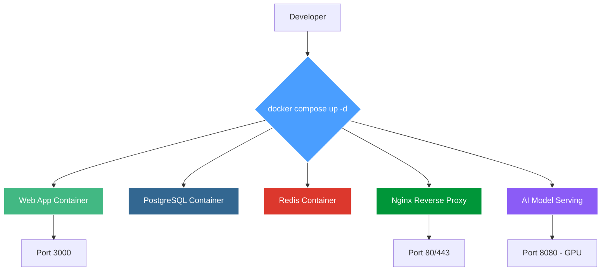
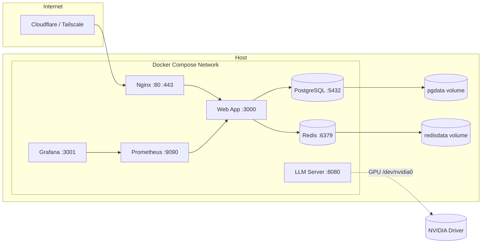
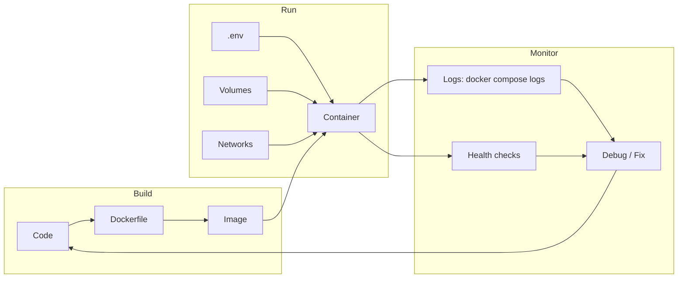

# Docker Compose — Ready-to-Deploy Stack Templates

Production-ready Docker Compose templates for web apps, databases, reverse proxies, and AI model serving — one command to spin up your entire stack.



## Table of Contents

1. [Overview](#1-overview)
2. [Features](#2-features)
3. [Architecture](#3-architecture)
4. [Prerequisites](#4-prerequisites)
5. [Quick Start](#5-quick-start)
6. [Templates](#6-templates)
   - [Web App + PostgreSQL + Redis + Nginx](#61-web-app--postgresql--redis--nginx)
   - [AI Model Serving with GPU](#62-ai-model-serving-with-gpu)
   - [Monitoring Stack](#63-monitoring-stack)
   - [Development Hot-Reload Setup](#64-development-hot-reload-setup)
7. [Configuration](#7-configuration)
8. [Usage](#8-usage)
9. [Key Patterns](#9-key-patterns)
10. [Common Pitfalls](#10-common-pitfalls)
11. [FAQ](#11-faq)
12. [Troubleshooting](#12-troubleshooting)
13. [License](#13-license)

## 1. Overview

This repository provides a collection of copy-and-paste Docker Compose templates for common production and development stacks. Each template is designed to work immediately — no modifications needed beyond setting environment variables. The templates cover:

- Full-stack web apps with PostgreSQL, Redis, and Nginx
- AI model serving with GPU passthrough (Linux / NVIDIA)
- Monitoring with Prometheus + Grafana
- Hot-reload development environments

All templates use Compose v3.8+ syntax and are compatible with Docker Compose v2.

## 2. Features

- **Zero-config templates** — copy, set a `.env` file, run `docker compose up -d`
- **GPU passthrough** — NVIDIA GPU support for LLM inference containers
- **Production defaults** — restart policies, health checks, named volumes
- **Security-first** — never hardcode secrets, use `.env` or Docker secrets
- **Cross-platform** — works on macOS, Linux, and cloud VPS
- **Monitoring built-in** — optional Prometheus + Grafana stack
- **Hot-reload dev** — Vite dev server with bind mounts and anonymous volume

## 3. Architecture



All services communicate over an internal Docker bridge network. Only Nginx (and optionally the LLM server) expose ports to the host. Databases and caches are isolated.

## 4. Prerequisites

| Tool | Version | Install |
|------|---------|---------|
| Docker | 24+ | [docs.docker.com/get-docker](https://docs.docker.com/get-docker) |
| Docker Compose | v2+ | Included with Docker Desktop / `brew install docker-compose` |
| NVIDIA Container Toolkit | latest | Required for GPU templates on Linux |

**Platform notes:**

- **macOS**: No GPU passthrough — use CPU-only LLM templates or remote GPU
- **Linux**: Full GPU support with `nvidia-container-toolkit`
- **VPS (1GB RAM)**: Use Alpine images, limit memory with `mem_limit: 256m`, prefer SQLite over PostgreSQL

## 5. Quick Start

```bash
# 1. Clone or copy a template
git clone https://github.com/nerudek/docker-compose.git
cd docker-compose

# 2. Create an environment file
cp .env.example .env   # or create manually

# 3. Start the stack
docker compose up -d

# 4. Check logs
docker compose logs -f

# 5. Stop everything
docker compose down
```

For production, always use `.env` for secrets and never commit it.

## 6. Templates

### 6.1 Web App + PostgreSQL + Redis + Nginx

Full production stack for any web application:

```yaml
version: '3.8'
services:
  app:
    build: .
    ports: ['3000:3000']
    environment:
      DATABASE_URL: postgresql://user:pass@db:5432/app
      REDIS_URL: redis://cache:6379
    depends_on: [db, cache]
    restart: unless-stopped
    volumes: ['./uploads:/app/uploads']

  db:
    image: postgres:16-alpine
    environment:
      POSTGRES_USER: user
      POSTGRES_PASSWORD: pass
      POSTGRES_DB: app
    volumes: ['pgdata:/var/lib/postgresql/data']
    restart: unless-stopped

  cache:
    image: redis:7-alpine
    volumes: ['redisdata:/data']
    restart: unless-stopped

  nginx:
    image: nginx:alpine
    ports: ['80:80', '443:443']
    volumes: ['./nginx.conf:/etc/nginx/nginx.conf', './ssl:/etc/nginx/ssl']
    depends_on: [app]
    restart: unless-stopped

volumes:
  pgdata:
  redisdata:
```

### 6.2 AI Model Serving with GPU

Serve GGUF models with GPU acceleration on Linux:

```yaml
version: '3.8'
services:
  llama:
    image: ghcr.io/ggerganov/llama.cpp:full
    ports: ['8080:8080']
    volumes:
      - /Volumes/2TB_APFS/models:/models:ro
    command: >
      --server --port 8080
      --model /models/qwen3.5-27b.Q4_K_M.gguf
      --n-gpu-layers 99
      --ctx-size 32768
    deploy:
      resources:
        reservations:
          devices:
            - driver: nvidia
              count: 1
              capabilities: [gpu]
    restart: unless-stopped
```

**Note**: GPU passthrough requires Linux with NVIDIA Container Toolkit installed. On macOS, run CPU-only.

### 6.3 Monitoring Stack

Lightweight monitoring with Prometheus and Grafana:

```yaml
version: '3.8'
services:
  prometheus:
    image: prom/prometheus:latest
    ports: ['9090:9090']
    volumes: ['./prometheus.yml:/etc/prometheus/prometheus.yml', 'prometheus_data:/prometheus']
    command: ['--config.file=/etc/prometheus/prometheus.yml', '--storage.tsdb.path=/prometheus']

  grafana:
    image: grafana/grafana:latest
    ports: ['3001:3000']
    environment:
      GF_SECURITY_ADMIN_PASSWORD: admin
    volumes: ['grafana_data:/var/lib/grafana']
    depends_on: [prometheus]

volumes:
  prometheus_data:
  grafana_data:
```

Change the Grafana admin password immediately on first login.

### 6.4 Development Hot-Reload Setup

Hot-reload development environment with Vite:

```yaml
services:
  dev:
    build:
      context: .
      dockerfile: Dockerfile.dev
    ports: ['5173:5173']
    volumes:
      - ./:/app
      - /app/node_modules  # anonymous volume — don't overwrite
    environment:
      NODE_ENV: development
    command: npm run dev -- --host
```

The anonymous `/app/node_modules` volume prevents the host's `node_modules` from overwriting the container's Linux-native one.

## 7. Configuration

All templates use environment variables for configuration. Never hardcode secrets in `docker-compose.yml`.

**Environment file (.env):**

```bash
# Database
POSTGRES_USER=myapp
POSTGRES_PASSWORD=change_me_now
POSTGRES_DB=myapp

# Redis
REDIS_PASSWORD=change_me_too

# App
NODE_ENV=production
DATABASE_URL=postgresql://${POSTGRES_USER}:${POSTGRES_PASSWORD}@db:5432/${POSTGRES_DB}
REDIS_URL=redis://:${REDIS_PASSWORD}@cache:6379
```

**Production secrets:** Use Docker secrets (`docker secret create`) or an external secret manager (HashiCorp Vault, AWS Secrets Manager, Doppler).

## 8. Usage

```bash
# Start all services
docker compose up -d

# Start specific services only
docker compose up -d app db

# View logs
docker compose logs -f --tail 50

# Execute commands inside a running container
docker compose exec app npm run migrate

# Rebuild and restart after config changes
docker compose up -d --build

# Stop and clean up (removes containers, keeps volumes)
docker compose down

# Full cleanup (removes volumes too — destroys data)
docker compose down -v

# Run a separate project instance
docker compose -p myproject2 up -d
```

## 9. Key Patterns

- **Health checks**: Always add `curl -f http://localhost:3000/health || exit 1` for production services
- **Secrets**: `.env` for local dev, Docker secrets or external manager for production
- **Restart policy**: `unless-stopped` for daemons, `no` for batch jobs, `on-failure` for workers
- **Volumes**: Named volumes for databases (durable data), bind mounts for dev code
- **Networks**: Compose auto-creates a network; all services resolve each other by service name
- **Resource limits**: Use `mem_limit: 256m` and `cpus: '0.5'` to constrain containers on small VPS
- **Image pinning**: Pin major versions (`postgres:16-alpine` not `postgres:latest`) in production



## 10. Common Pitfalls

1. **Running as root** — Always use `USER appuser` in Dockerfile; root inside containers is a security risk
2. **Vite `--host` flag** — Forgot it? The dev server binds to 127.0.0.1 inside the container and is unreachable
3. **Database in compose file** — Hardcoding `POSTGRES_PASSWORD` in `docker-compose.yml` leaks credentials; use `.env`
4. **Port conflicts** — `lsof -i :PORT` to find what's listening; change the host port if needed
5. **Mac bind mount performance** — Add `:cached` or `:delegated` to volume mount for better filesystem perf
6. **node_modules mismatch** — Use anonymous volume `/app/node_modules` in dev to avoid host OS conflicts
7. **GPU on macOS** — Docker for Mac has no GPU passthrough; run LLM templates CPU-only or on Linux

## 11. FAQ

**Q: How do I manage secrets properly?**
Use `.env` for local dev, Docker secrets or external secret manager in production. NEVER commit `.env`.

**Q: Can I run this on a VPS with 1GB RAM?**
Yes. Use Alpine images, limit container memory with `mem_limit: 256m`, and avoid running PostgreSQL (use SQLite or external DB).

**Q: How do I update containers?**
`docker compose pull && docker compose up -d --build`.

**Q: When do database migrations run?**
Add an init container or entrypoint script: `npm run migrate && npm start`.

**Q: How to back up database volumes?**
`docker compose exec db pg_dump -U user app > backup.sql`.

**Q: Can I run multiple instances on different ports?**
Use `docker compose -p project2 up -d` with a different project name.

**Q: How to expose to the internet securely?**
Put Cloudflare Tunnel or Tailscale Funnel in front — never expose raw Docker ports to 0.0.0.0.

**Q: What about Let's Encrypt for HTTPS?**
Use Caddy or Traefik as reverse proxy instead of Nginx — they auto-handle TLS certs.

**Q: How to run cron jobs inside Docker?**
Use `ofelia` — a Docker-native cron scheduler. Or create a separate container with a cron daemon.

**Q: How do I limit disk usage for a container?**
Use `storage_opt: { size: 10G }` in the service definition.

## 12. Troubleshooting

| Symptom | Likely Cause | Fix |
|---------|-------------|-----|
| Container restart loop | Dependency not ready | Add `depends_on` with `condition: service_healthy` |
| Port already in use | Another service on same port | `lsof -i :PORT`, change host port in compose |
| Permission denied | Running as root or wrong UID | Use `USER` directive in Dockerfile |
| GPU not available | Missing NVIDIA toolkit | Install `nvidia-container-toolkit` on host |
| Slow bind mounts on Mac | macOS filesystem overhead | Add `:cached` or `:delegated` to volume |
| `Module not found` inside container | node_modules mismatch | Use anonymous volume trick in dev |
| Can't reach container from browser | Service binds to localhost | Add `--host 0.0.0.0` to app command |

**Debug workflow:**

```bash
# 1. Check which containers are running
docker compose ps

# 2. View recent logs
docker compose logs app --tail 50

# 3. Inspect a container
docker inspect <container_name>

# 4. Shell into a container
docker compose exec app sh

# 5. Check Docker disk usage
docker system df
```

## 13. License

MIT License — see [LICENSE](./LICENSE) for details.

---

If this saved you time: [PayPal.me/nerudek](https://www.paypal.me/nerudek)
GitHub: [github.com/nerudek](https://github.com/nerudek)
